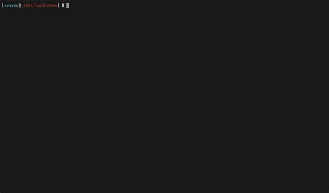

# cURL DOOM

**DOOM, played over `curl`.**

HTTP server rendering DOOM frames into ANSI half-blocks, streamed to the
terminal over HTTP with cURL.

No install, no dependencies except `curl` and `bash`.


## Two ways to play

### 1. The friendly way: `curl | bash`

```bash
curl -sL http://localhost:3000 | bash
```

### How does it work?

GET `/` is content-negotiated: a `curl` gets back `play.sh` with
`__SERVER__` rewritten to whichever host you fetched it from. The script
runs the per-keystroke `/tick` loop, handles `stty`, the alternate screen,
the cursor, and cleanup.

A browser hitting the same URL gets a tiny landing page that just shows
the one-liner.

### 2. The masochistic way: pure `curl`, no shell loop

```bash
stty -echo -icanon min 1 time 0 && curl -sN -X POST -T - localhost:3000/play
```

* Default small screen. See below to set columns and rows.
* Press any key to start playing.
* Ctrl+C to quit. 'q' doesn't work here.
* `reset` to fix your terminal back.



If you don't want to use the default small screen here, set the columns
and rows:

`curl -sN -X POST -T - "localhost:3000/play?cols=200&rows=60"`

### How does it work?

One streaming HTTP request, two directions: keystrokes go up the
request body, ANSI frames come down the response body. No key-loop
wrapper, no per-keystroke round-trip. This is Just a single TCP connection
doing both halves at once.

The catch: the shell normally puts the terminal in **cooked mode**,
which (a) line-buffers stdin so curl doesn't see a key until you hit
Enter, and (b) echoes everything you type on top of the frames. So you
have to flip the terminal into raw mode first, and put it back when
you're done. Hence the `stty` command before the `curl` and having to
call `reset` to set it straight.

You can also do it cleanly this slightly longer way:

```
( stty -echo -icanon min 1 time 0 < /dev/tty
  trap 'stty sane < /dev/tty' EXIT INT TERM
  curl -sN -X POST -T - localhost:3000/play < /dev/tty )
```

(See note above on setting rows and columns.)

Held-key behavior: the server releases each key 150 ms after the last
byte for it, so holding `w` moves you smoothly forward. Press Ctrl-C)
to disconnect. The trap restores the terminal either way.

## On smoothness

`/play` defaults to **15 fps**, because curl with `-T -` doesn't service
the response socket while stdin is silent (it's blocked in
`read(stdin)`), so frames pile up in the kernel send buffer between
keystrokes and burst-drain when you press something. 15 fps
keeps the bursts small enough that the terminal can render each frame
before the next one arrives. To override:

```bash
... "http://localhost:3000/play?cols=200&rows=60&fps=25" …
```

Frames overwrite the previous frame in place via cursor-home (no
per-frame screen clear), so even when a slow terminal can't keep up
the worst you'll see is a "torn" frame (a top from frame N+1, bottom
from frame N) instead of a blank one.

If you just want to **watch** without playing (frames stream regardless
of input), no `stty` is needed and no `-T -` blocking happens, so the
default 15 fps is perfectly smooth and you can crank it higher:

```bash
curl -sN -X POST "http://localhost:3000/play?cols=200&rows=60&fps=30"
```

Doom plays itself idly. Hit Ctrl-C when bored.

## Implementation

```
   terminal                             cURL DOOM server
   -------------                        ----------------
   curl GET  /          ---------->     play.sh
                        <----------     (with __SERVER__ rewritten)
   pipe to bash

   stty raw mode
   read keypress
   curl POST /tick?s=&key=  -------->   feed key into doom session
                            <--------   ANSI frame from doom's framebuffer
   print to /dev/tty
   loop
```

The server keeps one [`doomgeneric`](https://github.com/ozkl/doomgeneric)
process per session. Each session has:

* a stdin pipe used to push text commands (`K` keypress, `T` advance tics,
  `F` dump a frame, `Q` quit),
* a dedicated frame pipe on **fd 3** so doom's own `printf` logging on stderr
  can't corrupt the binary framebuffer,
* a virtual clock that the headless backend bumps inside `DG_SleepMs`, so
  doom's "wait until next tic" loop unblocks instantly instead of sleeping.

Each frame from doom is 640×400 BGRA pixels (1 MB). The server downsamples
to the terminal's `cols x rows*2` pixel grid using the upper-half-block
glyph `▀` (foreground = top pixel, background = bottom pixel, that's how
you get vertical resolution doubling for free), and only emits an SGR
escape when the color actually changes. That shrinks the response ~5x.

Idle sessions are reaped after 60 seconds. Killing the Node process kills
every child doom along with it.

## Server setup

This is only for hosting the game, not playing it.

### Requirements

- Node.js 18+
- A C compiler (`cc` / `clang` / `gcc`) and `make`
- doom1 shareware WAD
* doomgeneric source code

### Build & run

```bash
# 1. Install Node deps
npm install

# 2. Build the headless doom binary (once)
cd doomgeneric/doomgeneric && make -f Makefile.server && cd ../..

# 3. Start the server
npm start
# -> cURL DOOM running on http://localhost:3000
# -> Play with:   curl -sL http://localhost:3000 | bash
```

The code assumes on `doom1.wad` (the freely-distributed shareware
episode). To use a different WAD, drop it in the project root and edit
the `WAD` constant in `index.js`.

## Controls

| Key           | Action                   |
|---------------|--------------------------|
| `W` / `↑`     | Move forward             |
| `S` / `↓`     | Move backward            |
| `A` / `←`     | Turn left                |
| `D` / `→`     | Turn right               |
| `,` / `.`     | Strafe left / right      |
| `F`           | Fire                     |
| `Space` / `E` | Use / open door          |
| `Tab`         | Automap                  |
| `Enter`       | Menu confirm             |
| `Esc`         | Menu / back              |
| `Y` / `N`     | Yes / no in menu dialogs |
| `Q`           | Quit                     |

The session jumps straight into **E1M1 on Hurt me plenty** (`-warp 1 1
-skill 3`), so you skip the title screen and the menu dance.

## Customization

| Env var       | Default                 | Effect                      |
|---------------|-------------------------|-----------------------------|
| `DOOM_SERVER` | `http://localhost:3000` | Where the client connects   |
| `DOOM_COLS`   | terminal width          | Force a viewport width      |
| `DOOM_ROWS`   | terminal height − 1     | Force a viewport height     |
| `PORT`        | `3000`                  | Server-side: listening port |

The client auto-detects terminal size with `stty size < /dev/tty`
(reading the kernel's TTY state via `ioctl(TIOCGWINSZ)`, falling back
to `tput` and `$LINES`/`$COLUMNS` only if that fails). Doom's native
resolution under the half-block glyph is
320x200 pixels = **320 columns x 100 rows of terminal cells**, so anything
bigger gets clamped (it'd just be upscaling).

```bash
# Force a small viewport on a big terminal
DOOM_COLS=120 DOOM_ROWS=40 ./doom.sh

# Point at a remote server
DOOM_SERVER=https://doom.example.com ./doom.sh
```

## HTTP API

All routes accept `?cols=N&rows=N` to override the rendered viewport.

* `GET /`: Content-negotiated landing, script for curl, HTML for browsers
* `POST /new`: Create session, return 1st frame, `X-Session` header for session id
* `POST /tick?s=&key=`: Push one key, advance ~5 tics, return next frame
* `POST /play?cols=&rows=&fps=`: Bidi streaming, request body = keystrokes, response body = ANSI frames
  (default 15 fps, range 5-35)
* `POST /quit?s=`: Tear down a session immediately (instead of waiting 60 s)
* `GET /health`: `{"sessions": N}`

## Credits

- **Author**: Sawyer X.
- **Doom**: id Software, 1993.
- **doomgeneric**: by [ozkl](https://github.com/ozkl/doomgeneric),
  the abstraction that lets me swap in a custom rendering backend.
- **`doom1.wad`**: the shareware episode, freely distributable.

## Why?

Because DOOM.
